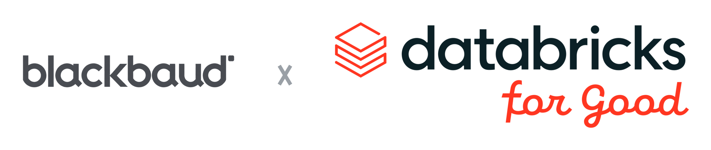

<p align="center">
  <picture>
    <source media="(prefers-color-scheme: dark)" srcset="docs/assets/header-dark.png">
    
  </picture>
</p>

# Blackbaud Fundraising Intelligence

## Background

This is a demo for BBCon to show:

1. How to read data from Blackbaud and put it in Databricks
2. What the best-practice repo looks like in Databricks
3. How you create and deploy jobs / dashboards / etc. in Databricks
4. How you leverage Genie to analyze your data

## Key Questions

### How do I get data out of Blackbaud?

Contact your rep — they need to run an IP whitelist. You can find the IP addresses in
the Databricks docs associated with your region (example: the Azure East US serverless
outbound ranges in the [Databricks IP ranges feed](https://www.databricks.com/networking/v1/ip-ranges.json)
— filter to `platform: azure`, `region: <your region>`, `type: outbound`). Note that we
typically use a serverless backend, so **many** IP addresses may need to be whitelisted.

1. Get the IP whitelist confirmed on Blackbaud's firewall
2. Get the connection string and password from Blackbaud
3. Use this template to create the connection:

```sql
CREATE CONNECTION blackbaud_nxt TYPE sqlserver
OPTIONS (
  host '<host from connection string>',
  port '<port>',
  user secret('blackbaud', 'bb_user'),
  password secret('blackbaud', 'bb_password'),
  trustServerCertificate 'true'
);

CREATE FOREIGN CATALOG blackbaud_nxt_test
  USING CONNECTION blackbaud_nxt
  OPTIONS (database '<initial catalog>');
```

Credentials live in a Databricks secret scope (`bb_user`, `bb_password`) — never inline
them. If a query fails with `FAILED_JDBC.CONNECTION` (a TCP-level "failed to connect",
not a login error), the whitelist isn't covering your serverless egress yet.

### What are some good prompts for Genie?

Go to `{yourworkspaceurl}/one` and try one of the following:

1. What data do you have access to?
2. Can you read my Gmail or Docs? Walk me through connecting to them.
3. How should I leverage Genie Code to build a dashboard off the data in this repo that focuses on donor health?
4. Riverside University Foundation is running a $343.8M campaign with $633.2M raised and $164M in open pipeline. Leadership worries the forecast leans too heavily on a few major gifts and that some priorities are lagging. Using our Blackbaud data, generate a strategic recommendations report for campaign leadership — cite the specific designation/fundraiser/opportunity behind each recommendation, and rank by expected dollar impact. ([example output](docs/examples/prompt_4_result.pdf))
5. Which fundraising priorities are furthest behind their goal, and how much open pipeline is available to close the gap?
6. Who are our top 20 prospects to solicit next, and what should we ask each of them for?
7. How concentrated is our pipeline in the largest gifts, and what happens to the forecast if the top few slip?
8. Which fundraisers are carrying the most weighted pipeline, and whose portfolio looks over- or under-loaded?

### Where should I go to learn more about Databricks?

If you're a nonprofit, we'd love to chat. Please reach out to **forgood@databricks.com**.
You can also reach out to your Databricks account team for further assistance. Happy coding!
